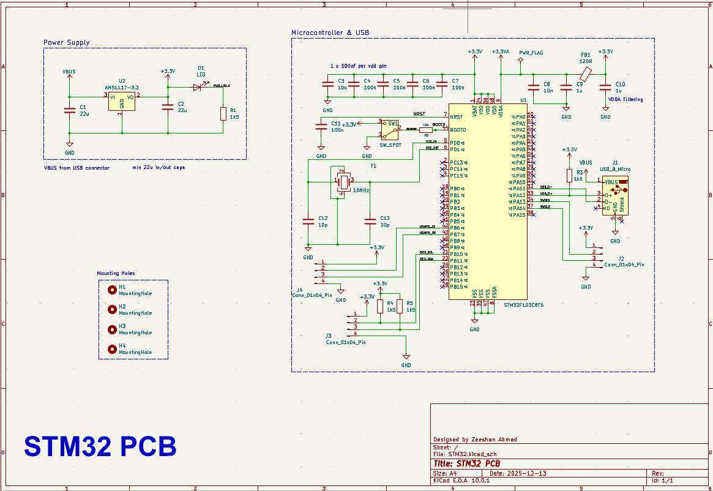
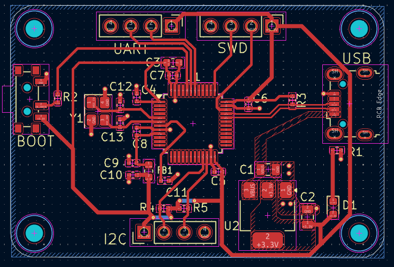
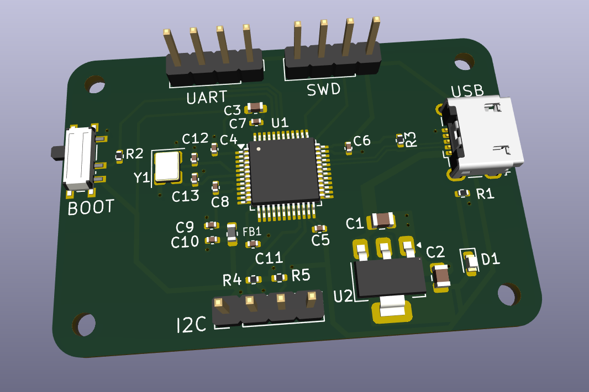

# STM32 Custom PCB Design

A custom STM32-based embedded system PCB designed in KiCad following professional PCB design practices inspired by Phil’s Lab.

## Overview

This project demonstrates the complete workflow of designing a professional embedded STM32 PCB from scratch instead of using ready-made development boards like the STM32 Blue Pill.

The PCB was designed with focus on:
- Clean routing
- Ground plane implementation
- Proper power distribution
- Compact embedded hardware layout
- Professional PCB engineering workflow

---

## Features

- STM32 microcontroller
- USB interface
- SWD programming/debugging header
- UART communication header
- BOOT mode switch
- I2C header
- Ground plane implementation
- Mounting holes
- Fully clean DRC
  - 0 Errors
  - 0 Warnings

---

## Tools Used

- KiCad
- STM32
- Git & GitHub

---

## PCB Preview

### Schematic


### PCB Layout


### 3D View


## Learning Outcomes

Through this project I learned:

- STM32 hardware design
- PCB routing techniques
- Ground plane usage
- Design Rule Check (DRC)
- Via sizing and routing
- Footprint customization
- USB and UART interfacing
- Embedded hardware workflow
- GitHub project management

---

## Folder Structure

```text
STM32-CUSTOM-BOARD/
│
├── KiCad/
├── Images/
├── README.md
└── LICENSE
```

---

## Future Improvements

- Add more GPIO breakout headers
- Add onboard sensors
- Add firmware examples
- Create a custom enclosure
- Add power protection circuitry

---

## Inspiration

This project was inspired by Phil’s Lab embedded hardware and PCB design tutorials.

---

## Author

Zeeshan Ahmad
